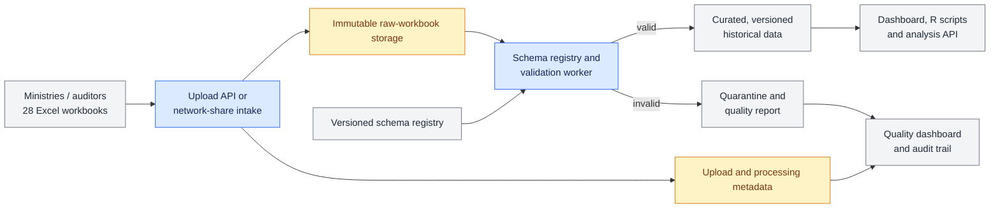

# ADR 0001: Target architecture for workbook ingestion and analysis

- Status: Accepted
- Date: 2026-09-29

## Context

Financial Audit receives 28 Excel workbooks from ministries and auditors. The
workbooks are currently placed on a network share, read directly by a dashboard
and R scripts, and are difficult to compare over multiple years. Templates also
change, and data-quality problems are not consistently visible or traceable.

The repository already proves the initial path: a FastAPI upload endpoint stores
a workbook locally and validates it synchronously with a JSON schema; notebooks
support exploratory validation. This is not sufficient for durable retention,
asynchronous processing, traceability, or stable consumer access.

## Decision

Adopt a pipeline that preserves each received workbook as an immutable source,
records every processing event, validates against an explicitly versioned
schema, and exposes only valid transformed data to analytics consumers.

Blue blocks are already demonstrated by the prototype. Amber blocks are the
next implementation step: persist the raw workbook durably and create a
metadata record for every upload. Grey blocks are later target capabilities.

### Data flow

1. A ministry or auditor submits a workbook through the upload API or a
   controlled network-share intake.
2. The original bytes are stored once in immutable raw storage. The platform
   assigns an upload ID and stores checksum, source, timestamps, locations,
   status, and processing history as metadata.
3. A worker selects an approved schema version, validates the workbook, and
   stores a quality report. Invalid workbooks go to quarantine; valid workbooks
   are transformed into the curated historical store.
4. Dashboards, R scripts, and an analysis API read curated data and quality
   information rather than source workbooks.

## Current prototype and production target

| Area | Current prototype | Production target |
| --- | --- | --- |
| Intake | FastAPI `POST /uploads`; local upload directory | Authenticated API and/or controlled share intake |
| Validation | Synchronous in-process validation against one configured JSON schema | Background worker selecting a registered, versioned schema |
| Storage | Local files and generated reports | Immutable object/file storage plus persistent metadata and quarantine |
| Analysis | Notebooks and consumers read Excel directly | Curated, queryable historical data with lineage |
| Operations | Basic `/health` endpoint | Separate liveness/readiness, logs, metrics, audit trail, alerts |

## Rationale

Raw workbooks are retained immutably so any result can be reproduced, disputed
data can be inspected, and a corrected schema or transform can be rerun without
asking a producer to resend a file. They are never replaced by duplicate
uploads; a checksum identifies identical content.

Validation is separate from analysis-ready data so invalid or unreadable files
cannot silently affect dashboards or R output. Quarantine retains both the
source reference and the report, making the quality issue actionable while
preserving a complete audit trail.

Schemas have stable IDs and versions, effective periods, owners, and JSON
definitions. Every metadata record and curated record retains the exact schema
version used, making template changes and historical comparisons traceable.

## Operating assumptions

- The service is packaged as a non-root container and deployed to the intended
  OpenShift/Kubernetes platform. Configuration, credentials, storage endpoints,
  and database connection details are supplied as secrets or environment
  variables, not embedded in an image.
- Raw workbooks, metadata, validation reports, and curated data have retention
  periods set by Financial Audit records-management and legal requirements.
  Raw files remain immutable for their approved retention period; deletion is a
  controlled, auditable lifecycle action.
- Access uses least privilege. Producers may submit files and view their own
  status where required; operators can inspect reports and metadata; authorised
  analysts read curated data. Raw workbooks are restricted because they may
  contain sensitive information.
- Financial Audit owns the semantic definition and approval of workbook
  schemas. A named data/platform owner operates the registry and deployment;
  schema changes are reviewed, versioned, and released before activation.

## Consequences

This architecture adds a metadata store, durable storage, worker execution,
schema governance, and operational dependencies. In return, it prevents direct
Excel consumption from becoming the analytics contract and provides the
lineage, quality visibility, and stable historical model needed for multi-year
analysis.

## Implementation sequence

The next change is to persist raw workbooks and upload/processing metadata
(Issue 2). The schema registry, worker, curated model, consumer API,
observability, and OpenShift deployment follow in the issue backlog.
